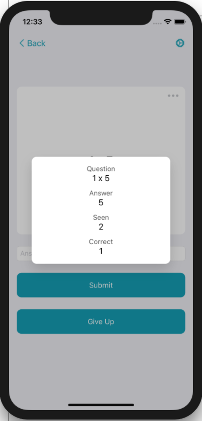

# PopupView

[](https://travis-ci.org/acsmith25/PopupView)
[](https://cocoapods.org/pods/PopupView)
[](https://cocoapods.org/pods/PopupView)
[](https://cocoapods.org/pods/PopupView)

## Introduction

CustomPopup allows you to modally present any view controller that dynamically sizes to its content on another in UIAlert style.  

## Example

To run the example project, clone the repo, and run `pod install` from the Example directory first.




## Installation

PopupView is available through [CocoaPods](https://cocoapods.org). To install
it, simply add the following line to your Podfile:

```ruby
pod 'CustomPopup'
```

## Usage

The controller you would like to present the pop up on should conform to the PopUpPresentationController Protocol

```swift
public protocol PopUpPresentationController {
    var gesture: UIGestureRecognizer? { get set }
    var popUp: PopUpController? { get set }
    func dismissPopUp()
}
```

To present the pop up:

```swift
let popUpController = YourCustomPopUpViewController()
popUp = PopUpController(popUpView: popUpController)
guard let popUp = popUp else { return }
popUp.presentPopUp(on: self)
```

It may be helpful to add a gesture to dismiss the pop up when a tap occurs outside the modal view:

```swift
gesture = UITapGestureRecognizer(target: self, action: #selector(dismissPopUp))
gesture?.delegate = self    //implement gestureRecognizer:shouldReceiveTouch:
guard let gesture = gesture else { return }
self.view.addGestureRecognizer(gesture)
```

## Author

acsmith25, acsmith25@crimson.ua.edu

## License

PopupView is available under the MIT license. See the LICENSE file for more info.
